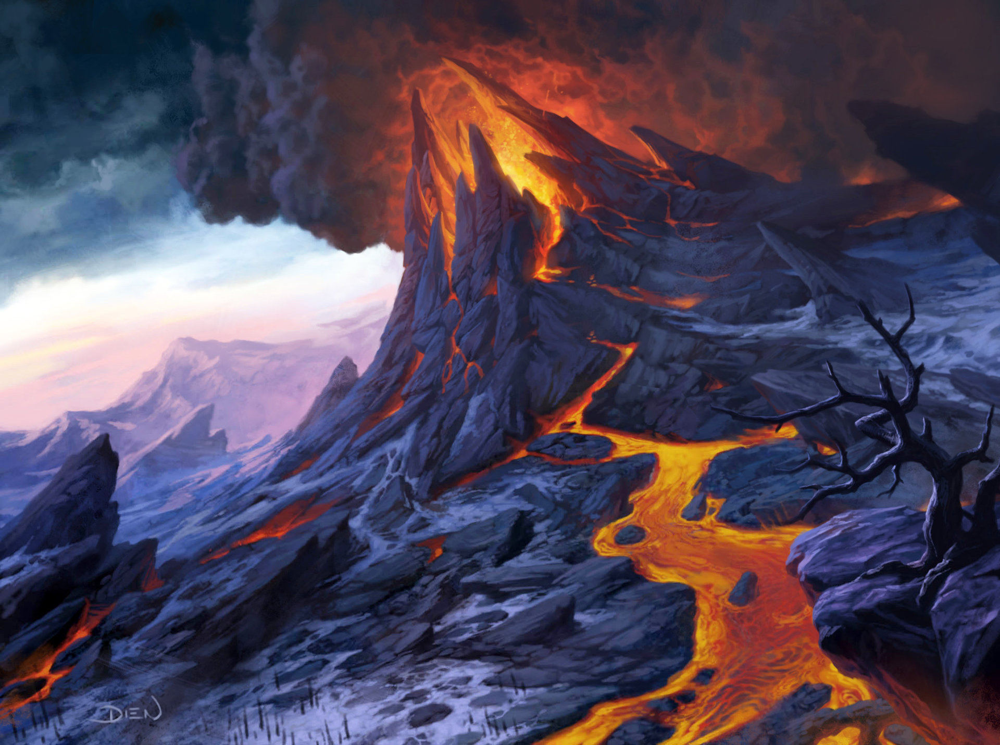

# The History of Alderwyn

Alderwyn is an ancient land steeped in deep history, shaped by the cycles of its gods, ancient powers, and the rise and fall of civilizations. The timeline of Alderwyn is marked by pivotal events, lost cultures, and ongoing struggles for dominance, knowledge, and survival.

The known history of Alderwyn spans for thousands of years. In the beginning Ranginui (the sky) and Papatuanuku (earth) were joined together, and their children were born between them in darkness. After they sundered the world in the Age of Dawn, the children decided to separate their parents. To allow light to come into the world. The children then became gods of the world.

## Age of Dawn (Pre-History)

Long before written history, Alderwyn was a land of raw nature, filled with primordial forests, towering mountains, and vast seas. It was a time when the gods walked among the earth, shaping the world with their divine hands. The world’s first peoples, known as the Alderwynians, lived in close harmony with the land, worshipping the great spirits of the earth, sky, and sea. These early inhabitants left behind ancient sites—stone circles, burial mounds, and mystical runes—hinting at their knowledge of magic and the divine.

the creator races- dominated the world. They built great cities of stone and glass, carved paths through the wilderness, tamed the great lizards, worked mighty magics, shaped the world around them, and warred upon each other. Those were the Days of Thunder. Their civilizations came to a sudden end some hundred thousand years ago. Perhaps their wars reached a terrible and inevitable crescendo, or they tampered with forbidden forces. For whatever reason, the world changed, and their vast empires vanished. All that remains of them are ruins and the scattered lizard folk, bullywug, aarakocra, and various tribes of barbaric descendants of hose who once ruled the world.