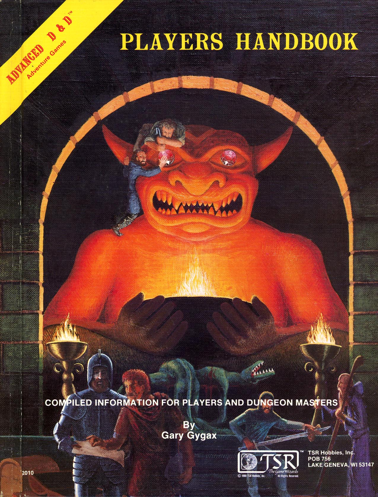

# Lifestyle and Wages

## About lifestyle and wages

Based on the D&D Player Handbook, there seem to be three tiers of people you could call "laborers". All quotes are from the Player's Handbook, pages 157-159, unless otherwise noted.

### Untrained, day-job laborers

- **Wage:** These laborers earn 1sp for a day's labor (PHB 143), doing tasks requiring no real training or skill. They also lack a stable job, which would otherwise pay more. They may be akin to real-life immigrant workers or individuals who have faced setbacks.

- **Lifestyle:** By default, these individuals would live a *Squalid* lifestyle (1sp/day):

  > You live in a leaky stable, a mud-floored hut just outside town, or a vermin-infested boarding house in the worst part of town. You have shelter from the elements, but you live in a desperate and often violent environment, in places rife with disease, hunger, and misfortune. You are beneath the notice of most people, and you have few legal protections. Most people at this lifestyle level have suffered some terrible setback. They might be disturbed, marked as exiles, or suffer from disease.

  This lifestyle suits someone struggling to find work due to illness, injury, or misfortune. These people are often poor and desperate, willing to do almost anything for 1sp/day, as the alternative might mean a "Wretched" lifestyle.

  They could, however, live at or near a *Poor* lifestyle (2sp/day) through various means:
  - Living in "Poor" conditions with double the occupancy, resulting in more crowded but improved conditions.
  - Working two jobs or extended hours to avoid squalid conditions.
  - Supplementing their income through additional means, such as theft, smuggling, or helping with occasional labor.

### Untrained Laborers with Jobs

- **Wage:** These workers earn 2sp/day, as stated in the "Untrained hireling" section of the services table. This wage corresponds to a long-term position and is comparable to the $15/hour minimum wage.

- **Lifestyle:** With a 2sp/day wage, these workers live at a *Poor* lifestyle level.

  > A poor lifestyle means going without the comforts available in a stable community. Simple food and lodgings, threadbare clothing, and unpredictable conditions result in a sufficient, though probably unpleasant, experience. Your accommodations might be a room in a flophouse or in the common room above a tavern. You benefit from some legal protections, but you still have to contend with violence, crime, and disease. People at this lifestyle level tend to be unskilled laborers, costermongers, peddlers, thieves, mercenaries, and other disreputable types.

  This lifestyle is a suitable thematic match for unskilled laborers with steady jobs; they experience "simple food and threadbare clothing," without necessarily living in slum conditions.

### Untrained Laborers with Jobs at a Castle, Temple, etc.

- **Wage:** These workers also earn around 2sp/day. However, the Player's Handbook notes in the services section:

  > If a high-level adventurer establishes a stronghold of some kind, he or she might hire a whole staff of servants and agents to run the place, from a castellan or steward to menial laborers to keep the stables clean. These hirelings often enjoy a long-term contract that includes a place to live within the stronghold as part of the offered compensation.

- **Lifestyle:** These laborers live a "Modest" lifestyle:

  > A modest lifestyle keeps you out of the slums and ensures that you can maintain your equipment. You live in an older part of town, renting a room in a boarding house, inn, or temple. You don't go hungry or thirsty, and your living conditions are clean, if simple. Ordinary people living modest lifestyles include soldiers with families, laborers, students, priests, hedge wizards, and the like.

  These workers might earn a few silver coins each day, but their living conditions are enhanced by the accommodations provided within the castle. They have "simple" but clean and safe living conditions, with food often provided. This arrangement offers significant improvement over what they could afford on their own wages, providing an incentive to work at a keep.

### Beyond Untrained Laborers

For skilled labor, the numbers align well. Hiring a skilled worker costs 2gp/day (PHB p.159), and the Comfortable lifestyle also costs 2gp/day. Skilled tradespeople are typically found at the Comfortable lifestyle level. Beyond this, the discussion moves into the upper classes of merchants and nobility.
