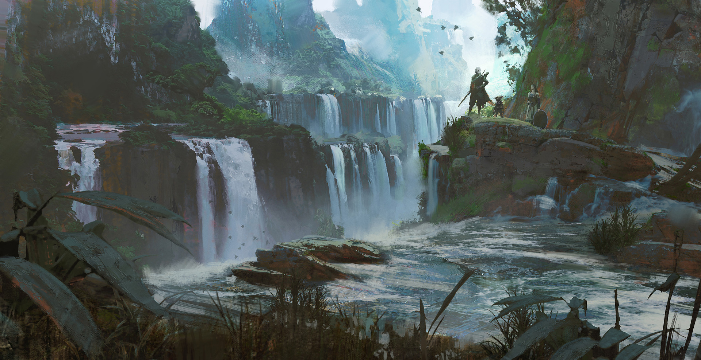

# History of Alderwyn

## About the History of Alderwyn

The known history of Alderwyn spans thousands of years, divided into distinct ages of wonder, chaos, and rebirth. In the beginning, before time itself existed, there were the Ori — timeless, shapeless beings of pure thought and power. When the Ori known as #Elior was born, Alderwyn came into existence, shaped by his dreams, thoughts, and silence. Over the ages, Alderwyn has witnessed the rise and fall of countless peoples and empires, the birth of magic, the scourge of pestilence, and the ongoing struggle for survival in the Age of Reckoning.

## The Birth of Worlds

Before time, space, and even existence, there were only the Ori — beings of pure thought, concept, and infinite potential. They did not live as mortals do; they simply were. Each Ori was a universe unto themselves, containing endless possibilities. When an Ori comes into being, a new Plane of Existence is created around it — a reflection of its essence. Thus, the birth of each Ori is an act of cosmogenesis, spontaneous and inevitable. They are are eternal and immutable. Beyond magic and death. Even beyond even the laws of reality. They do not interfere with their creations — for they are both within and outside them.

Among the infinite expanse, the Ori named Elior came into existence. He was born not from desire, conflict, or emotion — but from the necessity of balance. Where other Ori radiated chaos or pure thought, Elior's essence was one of creation. When Elior's consciousness first stirred, the void around him quivered.

    Where his thoughts drifted, mountains rose.
    Where his dreams flowed, rivers and seas filled the empty darkness.
    Where his silence lingered, the skies stretched and stars blinked into being.

Thus, the world of Alderwyn was formed — not sculpted with hands, but made into existence by Elior’s mind. Initially, Alderwyn was a raw and untamed place. Vast oceans churned beneath stormy skies. Mountains pierced the heavens. Forests grew wild and ancient before a single beast walked them. There was no order or chaos yet — only potential. Magic as a force did not yet exist in any refined form. The energies that shaped the land were raw — not spells, but will made manifest.

    Although Elior's essence is Alderwyn, he — like all Ori — remains detached:
    He does not rule.
    He does not guide.
    He simply exists, both part of and apart from the world.
    Most inhabitants of Alderwyn know nothing of the Ori. A few ancient religions and scholars, however, whisper of the Great Creator.

It is said among ancient philosophers and mystics that:

    When Elior dreams, worlds awaken; When Elior sighs, mountains crumble;
    And should Elior ever awaken fully, Alderwyn shall be remade or erased."

## The Age of Chaos

The Age of Chaos marks the earliest era of Alderwyn’s history — a time when the world was untamed, wild, and primal. This period is characterized by creation, instability, and the emergence of the first life forms. At this point, Elior’s had only just begun to take shape, and the world was still in a state of flux. The land was raw, unshaped by civilization, and magic was a force not yet understood.

Rivers and seas still carving new paths, mountains rising and collapsing. Magic was raw, unpredictable, and untamed, like a storm barely contained. Primitive beasts and primal creatures roamed the world. The first of these creatures were wild, driven by instinct and not intelligence.

Then came the creation of the First Beasts and Monsters. The first wild creatures came into existence. These were not the proud, morally-driven races like elves or dwarves, but beings of instinct and primal energy. They were wild, dangerous, and shaped by the raw magic of the world.

### The First Races

These beings are the ancestors of many monstrous and animalistic races, and they play a crucial role in the world’s early stages. Examples of Early Creatures:

- Lizardfolk – Scaly, primal beings who lived in the swamps, hunting and scavenging.
- Tabaxi – Feline-like humanoid creatures, agile and nomadic, prowling the forests.
- Tritons – Deep-sea dwellers, connected to the raw power of the oceans, living in harmony with the waters but unpredictable and dangerous.
- Firbolgs – Huge, gentle giants who roamed the great forests, connected to nature in a very primal way, though not yet understanding the complexities of the world.
- and many more

These creatures were created by the primordial forces, and many were unaware of their existence beyond survival and instinct. Magic had no form yet, only pure, unfiltered energy that sometimes made the beasts more powerful than they should have been.

### Chaos and Magic

In the Age of Chaos, magic was wild, unformed, and untamed. It acted much like the forces of nature: unpredictable, uncontrollable, and often destructive. It flowed freely in the world, shaping everything it touched but without any rhyme or reason.

Primal Magic: Magic as we know it today — with structure and laws — did not yet exist. Instead, there were raw elemental forces.

- Fire that burned in great uncontained bursts.
- Water that flooded or evaporated wildly, forming rivers or storms at random.
- Earth that shifted and trembled unpredictably, causing mountains to rise or plains to vanish.
- Air that howled like a fury, uncontained by any natural rhythm.

### Unsettled Nature

The world of Alderwyn during the Age of Chaos was a land constantly changing. Forests grew and died in a matter of weeks. Rivers would carve new canyons overnight, only for them to flood and vanish. The geography was not yet stabilized, and only a few areas could be considered somewhat "safe," but they were still dangerous by modern standards.

There were great swamps, home to the Lizardfolk, where the waters shifted erratically, and trees grew with magical energy. Vast, dense forests filled with dangerous beasts, changing constantly with magic-infused flora and fauna. Mountain ranges filled with erratic magic — where gravity sometimes twisted, and storms constantly raged. And the ocean itself seemed alive, constantly reshaping its coastlines.

### The End of the Age of Chaos

The Age of Chaos is often seen as a time of untamed creativity, freedom, and danger, but it could not last forever. Eventually, as the chaos began to stabilize, the Age of Pride began to emerge. Elior essance began to stabilize. The world gained a sense of order and purpose to avoid self-destruction.

But the Age of Chaos was not without its legacy:

- The wild and primal magic that shaped the first beasts became the foundation for all later arcane and divine magic.
- The chaotic creatures would evolve into the corrupted races that walked the world during the Age of Pride — a reminder of the chaos that birthed them.
- The land itself still bore scars from this wild time — areas where magic remained unstable, forests where creatures still thrived in primal chaos.

## The Age of Thrive

After the chaotic turmoil of the Age of Chaos, the world began to stabilize. The raw, wild magic that defined the previous age began to take a more refined, controlled form. The lands grew calmer, and the geography started to solidify. It was in this period that the Proud People began to emerge — races that embodied not just primal instincts but developed culture, moral codes, and civilization.

The Proud Races are those that Elior shaped with intention, imbuing them with the ideals of honor, morality, and courage. These are the civilizations that would go on to form the foundation of Alderwyn's cultures, and they are the first to rise above the chaos of the previous age.

### The Elves — Masters of Elegance and Magic

See [Elves Ancestry](../ancestries/elves.md)

### The Dwarves — Craftsmen and Masters of Stone

See [Dwarves Ancestry](../ancestries/dwarves.md)

### The Gnomes — Innovators and Inventors

See [Gnomes Ancestry](../ancestries/gnomes.md)

### The Halflings — Keepers of Joy and Community

See [Halflings Ancestry](../ancestries/halflings.md)

### Society, Trade, and Growth

During this period, the Proud People began to form complex societies and trade networks that spanned the known world. The Elves and Dwarves built great cities and kingdoms that became centers of culture and power, while the Half-Elves, Gnomes, and others facilitated cross-racial trade, knowledge-sharing, and diplomacy.

**The First Empires:** The Proud Races began to establish great empires and kingdoms. The Elves founded their eternal cities in the heart of Alderwyn, while the Dwarves built mighty fortresses in the mountains and underground caverns.

**Golden Age of Magic:** Magic flourished, and great scholars and mages explored the depths of arcane power. The Elves and Gnomes were the primary practitioners, but even the Dwarves crafted magical items of unimaginable power.

**Trade and Exploration:** As peace and order began to settle across Alderwyn, the Proud Races started to explore distant lands. Trade routes opened, and the exchange of goods, ideas, and culture flourished. The world, once chaotic, was becoming interconnected.

### The Decline of the Age of Thrive

Though the Age of Thrive was a time of prosperity and enlightenment, it did not last forever. Elior, the Ori who had brought this world into existence, was beginning to stir, and the forces of balance would soon demand a reckoning. The first corruptions began to take root, and the age of strife loomed on the horizon. Still, the legacy of the Proud Races would endure, setting the stage for the Age of Corruption and the coming Age of Reckoning.

## The Age of Corruption

The Age of Corruption marks the tragic decline following the golden prosperity of the Age of Thrive. It was not a single cataclysm that brought this age about, but a slow rot — a corruption that grew within the hearts of the Proud People themselves. When Elior stirred in the cosmic planes — not fully waking, but dreaming unsettling dreams — magic itself shifted.
A new force seeped into Alderwyn: temptation, ambition, and the hunger for power.

